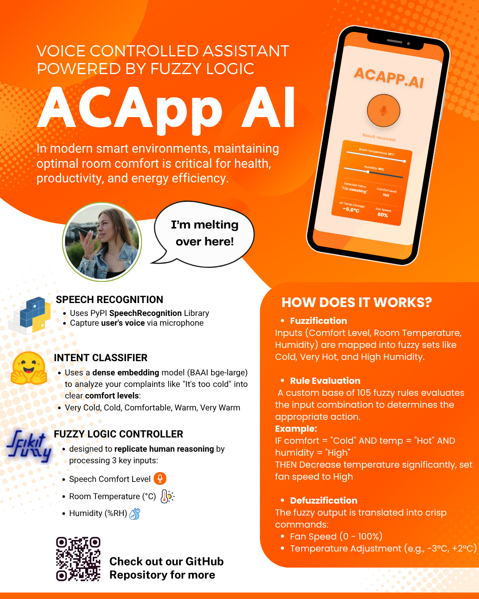

# 🔊 ACApp AI – Your Voice-Activated Comfort Companion

**ACApp AI** is an intelligent voice-controlled assistant powered by fuzzy logic and NLP.  
Designed to interpret natural speech, this system analyzes your comfort-related commands (like _"It’s too hot!"_), classifies intent, and instantly adjusts fan speed and temperature using real-time fuzzy decision-making.

---

## 🚀 Features

- 🎤 **Speech Recognition**  
  Transcribes voice commands from the user.

- 🧠 **Intent Classification**  
  Understands the meaning behind what you say.

- 🌡️ **Fuzzy Logic Controller**  
  Calculates the optimal temperature and fan speed based on your expression of comfort, environment temperature and humidity.

- 🗣️ **Text-to-Speech (TTS)**  
  Provides verbal feedback, making the assistant feel more interactive and alive.

---

## 👨‍💻 Project Members

This project was developed as part of the **Computational Intelligence** course.

- **Fadzlee Adam bin Mohd Nazlee** (A24AI0027)
- **Muhammad Isbullah bin Md Hambali** (A24AI0059)
- **Muhammad Lukman bin Nasrum** (A24AI0061)
- **Muhammad Zahin bin Mohd Zamri** (A24AI0065)
- **Raqib Hazim bin Abdul Hamid** (A24AI0118)

---

Just speak. No buttons, no hassle — **comfort made simple**.

## Poster

